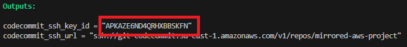
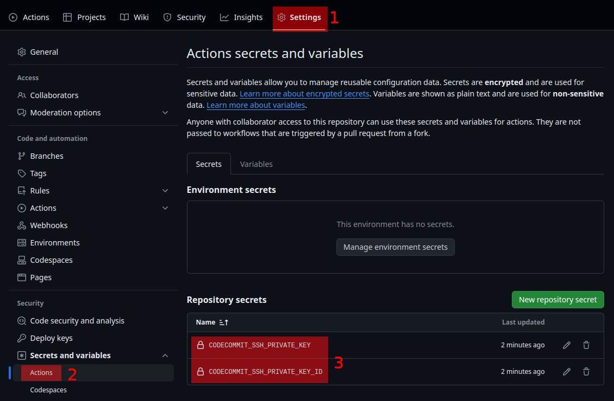
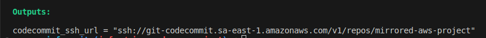
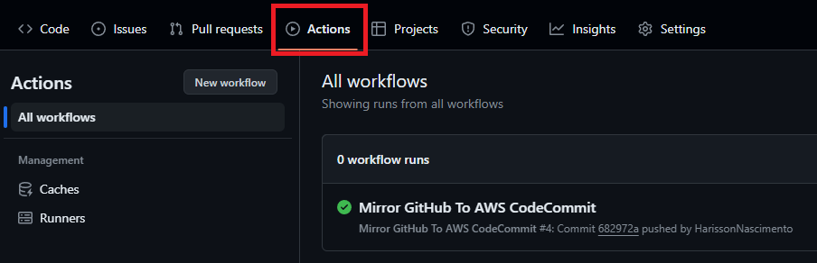

## Mirror configuration

#### First step
After executing ```terraform apply``` in the [aws-infra](https://github.com/HarissonNascimento/aws-infra) repository, see the output variable ```codecommit_ssh_key_id``` and copy the value.





In this repository, go to **Settings > Secrets and variables > Actions > Edit secrets**





Edit 2 secrets in the repository


> | Key | Value |
> |---|---|
> | CODECOMMIT_SSH_PRIVATE_KEY | privatekey.pem (RSA Private Key Content file in  [aws-infra](https://github.com/HarissonNascimento/aws-infra/blob/infra/mirrored-aws-project/privatekey.pem)) |
> | CODECOMMIT_SSH_PRIVATEKEY_ID | APKXXXXXXXXXXXXXXXXX (SSH Key, copied in the previous step) |

#### Second Step


See the output variable ```codecommit_ssh_url``` and copy the value.





In the [worflow mirror file](./.github/workflows/mirror.yml) edit the ```target_repo_url``` variable with ```codecommit_ssh_url``` copied value.

Example:

```
...
with:
    target_repo_url: ssh://git-codecommit.sa-east-1.amazonaws.com/v1/repos/mirrored-aws-project
...
```

#### Third step


Check the “Actions” tab of the repository to verify that the workflow was triggered and the workflow run was successful.



---